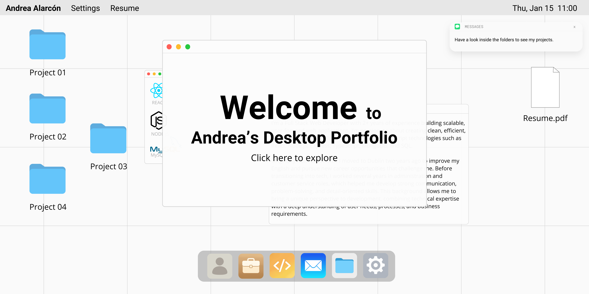

<h3 align="center">Full Stack Developer | React, TypeScript, Node.js, Express.js, MongoDB & SQL</h3>

I build beautiful, user-friendly web apps and scalable backends. Passionate about clean code, responsive design, and learning new technologies every day. 🌱

## Learn more about me

- 🌍 Based in Dublin, originally from Barcelona
- 🧠 Fluent in English, Spanish and Catalan
- 💡 Passionate about creating scalable web applications and intuitive UI/UX
- 🤖 Currently self-studying Artificial Intelligence, exploring machine learning and neural networks to expand my full-stack skill set
- 💻 Currently exploring new job opportunities in full-stack development
- 📬 How to reach me: Send me a message on [LinkedIn](https://www.linkedin.com/in/andreaalarconvaldes) or have a look at [MY PORTFOLIO](https://andreaalarconvaldes.github.io/portfolio-andrea/)
- ⚡ Fun fact: Love animals, hiking, plants, and traveling

## Skills

 

## 📫 Connect with me

 

   

